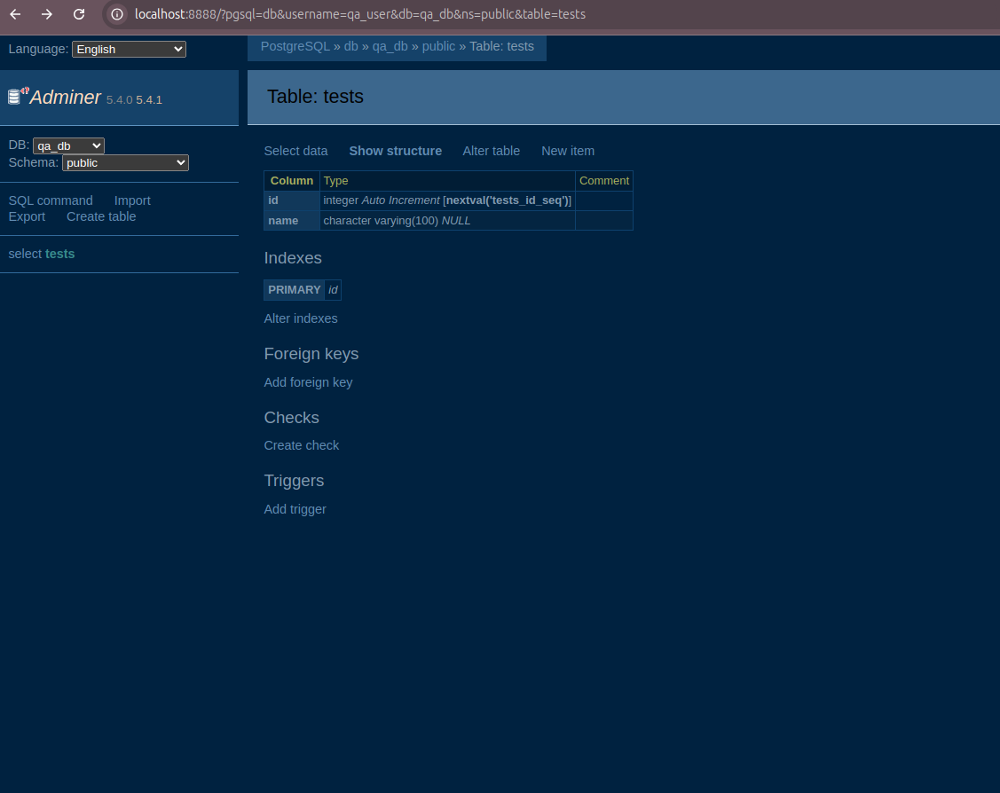

# Rezolvare Laborator Docker Compose

## Screenshot Adminer

## Importanta flag-ului -v

Flag-ul -v sterge toate volumele de date. In QA, asta inseamna ca fiecare test incepe cu un mediu curat, fara date vechi care ar putea cauza probleme.
